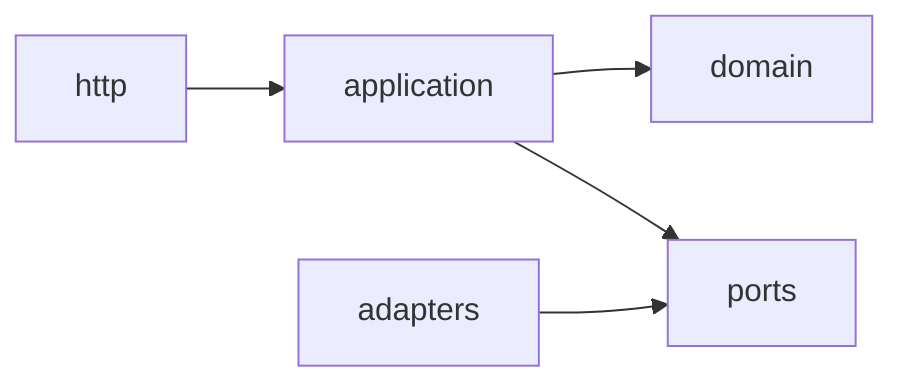

# Architecture Playbook: Hexagonal + DDD-lite

Этот документ — рабочий гайд по текущей архитектуре `back-project` (придумать название).  
Цель: чтобы любой инженер мог понять устройство системы и последовательно добавлять новые модули/use-cases без нарушения слоёв.

---

## 1. Архитектурное решение

Выбран подход:
- `modular monolith` (один deployable backend);
- `hexagonal architecture` (ports/adapters);
- `DDD-lite` (доменные сущности + инварианты без оверинжиниринга).

Почему:
- быстрый старт и простой деплой;
- изоляция бизнес-логики от HTTP/ORM/интеграций;
- возможность масштабировать код по модулям.

---

## 2. Структура проекта и ответственность

## 2.1 Core

- `src/app/core/config/*` — конфигурация приложения (`server`, `database`, `log`, `tracer`).
- `src/app/core/containers.py` — базовый контейнер зависимостей (shared infra).
- `src/app/core/fastapi/*` — общие middleware/helpers для FastAPI.
- `src/app/core/errors/*` — базовые ошибки приложения/домена.

## 2.2 Dependency

- `src/app/dependency/container.py` — composition root (сборка графа зависимостей).
- `src/app/dependency/uow_container.py` — фабрики UoW.
- `src/app/dependency/use_case_container.py` — фабрики use-cases.

## 2.3 Shared

- `src/app/shared/uow.py` — базовый `AsyncBaseUnitOfWork`.
- `src/app/shared/repository.py` — базовый `BaseAsyncRepository`.
- `src/app/shared/transactional.py` — `@async_transactional`.
- `src/app/shared/bootstrap.py` — создание FastAPI app + startup lifecycle.

## 2.4 Modules

Каждый модуль в `src/app/modules/<module_name>` имеет:
- `domain/`
- `application/`
- `ports/`
- `adapters/`
- `http/` (для входного HTTP adapter, если требуется).

---

## 3. Контракты слоёв

Зависимости разрешены только в одну сторону:

Правила:
- `domain` не импортирует `application/http/adapters`.
- `application` не импортирует ORM-модели и SQL.
- `http` не ходит в БД напрямую, только через use-cases.
- `adapters` реализуют `ports`, не наоборот.

---

## 4. Паттерны, которые уже используются

## 4.1 DTO vs HTTP Schema

- `application/dto.py` — внутренние команды/ответы use-case.
- `http/schemas.py` — внешний API контракт.

Зачем разделять:
- API может меняться независимо от внутреннего контракта;
- проще контролировать.

## 4.2 Repository Pattern

- `shared/BaseAsyncRepository` — общий CRUD/query boilerplate.
- модульный repository (`adapters/repository.py`) — доменный маппинг и модульная специфика.

## 4.3 Unit of Work

- `shared/AsyncBaseUnitOfWork` — жизненный цикл сессии + commit/rollback.
- модульный UoW (`adapters/uow.py`) — подключение конкретных репозиториев модуля.

## 4.4 Transaction Decorator

`@async_transactional()`:
- открывает UoW-контекст;
- выполняет commit для write use-case;
- поддерживает `read_only=True` для read use-case;
- поддерживает `reuse_session=True` в nested сценариях.

---

## 5. Как добавить новый модуль

Пример: добавить модуль `rules`.

### Шаг 1. Создать структуру

Создать:
- `modules/rules/domain`
- `modules/rules/application`
- `modules/rules/ports`
- `modules/rules/adapters`
- `modules/rules/http`

### Шаг 2. Domain

В `domain`:
- сущности (entities/value objects);
- инварианты и доменные проверки;
- без зависимостей на FastAPI/SQLAlchemy.

### Шаг 3. Ports

В `ports`:
- repository contracts;
- UoW contract;
- внешние контракты (например, `SyncPort`, `MigrateExecutionPort`) при необходимости.

### Шаг 4. Application

В `application`:
- DTO команд/ответов;
- use-cases с бизнес-последовательностью;
- use-cases работают только через `ports`.

### Шаг 5. Adapters

В `adapters`:
- ORM models;
- SQLAlchemy repository (реализация repository port);
- модульный UoW (реализация UoW port).

### Шаг 6. DI wiring

Обновить:
- `uow_container.py` (фабрика UoW нового модуля);
- `use_case_container.py` (фабрики use-cases);
- при необходимости `container.py` (проводка зависимостей).

### Шаг 7. HTTP adapter

В `http/router.py`:
- endpoint -> request schema -> command DTO -> use-case -> response schema.

Подключить router в `src/app/http/router.py`.

### Шаг 8. Проверка

- ruff/lint;
- smoke API;
- docker run;
- запись решения в `docs/implementation-log.md`.

---

## 6. Как добавить новый use-case в существующий модуль

Пример: добавить `GetConfigModeProfileById`.

## 6.1 Изменения по слоям

1) `ports/repository.py`
- добавить контракт:
  - `get_by_id(profile_id: UUID) -> ConfigModeProfile | None`

2) `application/dto.py`
- добавить `Get...Query` (если нужна);
- добавить/переиспользовать output DTO.

3) `application/use_cases.py`
- добавить `GetConfigModeProfileByIdUseCase`;
- использовать `@async_transactional(read_only=True)`.

4) `adapters/repository.py`
- реализовать метод через `BaseAsyncRepository.get_by_id`.

5) `dependency/use_case_container.py`
- добавить фабрику нового use-case;
- добавить provider-функцию для FastAPI Depends.

6) `http/schemas.py` и `http/router.py`
- добавить endpoint `GET /settings/config-mode-profiles/{id}`;
- маппинг DTO -> response schema.

## 6.2 Почему именно такой порядок

- сначала контракт (`ports`) — фиксируем “что нужно”;
- затем application — фиксируем “какой сценарий”;
- затем adapter — “как это делаем технически”;
- затем DI/HTTP — интеграция сценария в приложение.

---

## 7. Где и когда использовать `@async_transactional`

Использовать:
- create/update/deactivate/run operations (write path).

Использовать с `read_only=True`:
- list/get/read operations.

Не использовать:
- в HTTP handlers;
- в repository adapters;
- в domain entities.

---

## 8. Принципы проектирования модулей

- Один use-case — один явный бизнес-сценарий.
- Domain не знает про БД/HTTP.
- Application не знает про SQLAlchemy/FastAPI.
- Adapter не содержит бизнес-правил (только маппинг/IO).
- UoW управляет транзакцией, use-case управляет бизнес-последовательностью.
- Любой endpoint должен идти через use-case, без прямого DB доступа.

---
