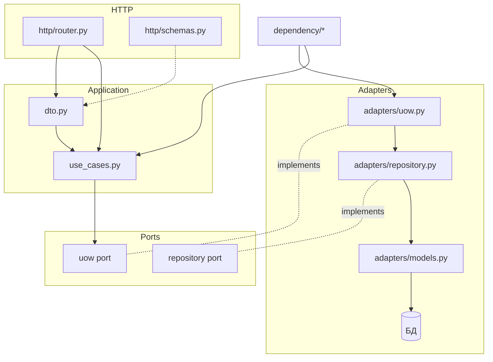

## 1. Дерево: `src/app/`

```text
src/app/
├── main.py                         # create_application + api router
│
├── core/                           #
│   ├── config/                     # Pydantic settings: server, database, log, tracer
│   ├── containers.py               # BaseContainer: async engine + session_factory (DI)
│   ├── errors/                     # Базовые ошибки
│   └── fastapi/                    # Общий middleware
│
├── db/                             # Подключение к БД
│   ├── connection.py               # create_engine, async_sessionmaker
│   └── base.py                     # SQLAlchemy Base (metadata.create_all в startup)
│
├── dependency/                     # Склейка конкретных классов модулей с инфраструктурой
│   ├── container.py                # BaseContainer + UoW container + UseCase container
│   ├── uow_container.py            # Фабрики модульных uow (сессия → репозитории)
│   └── use_case_container.py       # Фабрики use-case + функции для FastAPI Depends
│
├── http/                           # Корневой HTTP-слой: только сборка роутов
│   ├── router.py                   # include_router модулей + health
│   └── health.py                   #
│
├── shared/                         # Переиспользуемые технические абстракции
│   ├── bootstrap.py                # create_application: логи, DI, middleware, роуты, startup
│   ├── logging.py
│   ├── repository.py               # общий CRUD/query каркас
│   ├── transactional.py            # транзакция вокруг use-case
│   └── uow.py                      # сессия, commit/rollback
│
└── modules/                        # Бизнес-модули
    ├── settings/
    │   └── config_mode_profile/    # Расписанный для примера модуль
    │       ├── domain/
    │       │   └── entities.py     # Датакласс ConfigModeProfile
    │       │
    │       ├── ports/              # Контракты: что нужно application от внешнего мира
    │       │   ├── repository.py   # Интерфейс репозитория (без SQLAlchemy)
    │       │   └── uow.py          # Интерфейс UoW: доступ к repo в рамках транзакции
    │       │
    │       ├── application/        # Сценарии и внутренние DTO
    │       │   ├── dto.py          # Команды/ответы use-case (Pydantic)
    │       │   └── use_cases.py    # Create…, List… + @async_transactional
    │       │
    │       ├── adapters/           # инфраструктура модуля
    │       │   ├── models.py       # SQLAlchemy-модель таблицы (наследник app.db.base.Base)
    │       │   ├── repository.py   # Запросы к БД, маппинг ORM ↔ domain
    │       │   └── uow.py          # Конкретный UoW: открывает сессию, отдаёт repository
    │       │
    │       └── http/               # Входной адаптер: внешний API (HTTP)
    │           ├── schemas.py      # Request/response Pydantic
    │           └── router.py       # Endpoints, маппинг schema ↔ application DTO, Depends(use_case)
    │
    ├── audit/                      # Остальные модули
    ├── migrate/
    ├── reports/
    ├── rules/
    └── sync/
```


---

## 2. Пояснения

### `domain/`

**Зачем:**

описываем **бизнес-смысл** без БД, HTTP и фреймворков
Что за сущность, какие у неё поля, какие правила нельзя нарушать

**Что кладём:**

entity (агрегат / корень сущности), методы вроде `create()`, `validate()`, доменные исключения по смыслу


Главное правило: **внутри `domain/` нет импортов из `application`, `adapters`, `http`, SQLAlchemy.**

---

### `ports/`

**Зачем:**

это **контракты** для application: по типу "мне для сценария нужно уметь сохранить сущность/открыть транзакцию и получить". Здесь **нет реализации** — только абстрактные классы / Protocol.

**Что кладём:**

`*RepositoryPort`, `*UnitOfWorkPort`, при необходимости порты на внешние API, шину событий и т.д.

**Логика:**

не бизнес-алгоритмы, а **сигнатуры операций** (что можно вызвать из use-case). Реализует это уже `adapters/`.

---

### `application/`

**Зачем:**

**один файл/класс = один сценарий использования** (create, list, …): порядок шагов, вызовы через порты, граница транзакции (`@async_transactional`)

**`dto.py`:**

команды и ответы **внутри приложения** (Не из внешнего источника). HTTP слой переводит `schemas` ↔ `dto`

**Зависимости:**

только `domain`, `ports`, `shared` (декоратор транзакции). **Никаких** ORM-моделей

---

### `adapters/`

**Зачем:**

«как технически» выполнить то, что обещали порты.

| Файл | Для чего |
| --- | --- |
| **`models.py`** | Таблица SQLAlchemy Это **не** доменная модель; маппинг entity ↔ строка БД делает repository. |
| **`repository.py`** | Реализация port репозитория: `session.execute`, `add`, маппинг ORM → `domain` entity и обратно. |
| **`uow.py`** | Реализация port UoW: держит `AsyncSession`, создаёт конкретный repository, `commit`/`rollback` через базовый класс из `shared.uow`. |

Иными словами: **models = схема хранения**, **repository = запросы и преобразование в домен**, **uow = сессия + набор репозиториев в одной транзакции**.

---

### `http/` (внутри модуля)

**Зачем:**

всё, что **приходит и уходит наружу** по HTTP: пути, статусы, тела запросов/ответов в формате API.

**`schemas.py`:**

Pydantic-модели для OpenAPI; могут отличаться от `application/dto` (версионирование API, имена полей).

**`router.py`:**

привязка URL к use-case: распарсить body → собрать command DTO → `await use_case.execute(...)` → отдать response schema. **В БД напрямую не ходим.**

---

### Корневые `app/core`, `app/db`, `app/dependency`, `app/shared`, `app/http`

- **`core` + `db`:** настройки, движок БД, общий `Base`.
- **`shared`:** общие кирпичи для всех модулей (базовый UoW/repository, транзакции, bootstrap).
- **`dependency`:** единственное место, где видны **конкретные** классы из `adapters` и `use_cases` и где они собираются в граф.
- **Корневой `http`:** реестр роутеров модулей, без бизнес-логики.

---

Коротко: **domain** никого из внешних слоёв не знает; **application** знает **ports** и **domain**; **adapters** знают **ports** и технологии; **http** знает **application** и свои **schemas**.

---

## 6. Диаграмма потока (запрос → БД)



---
